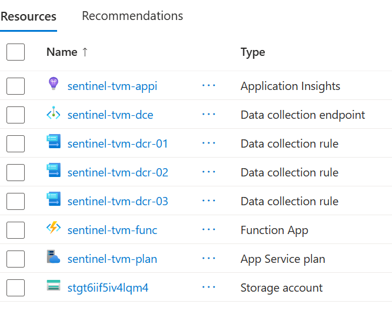
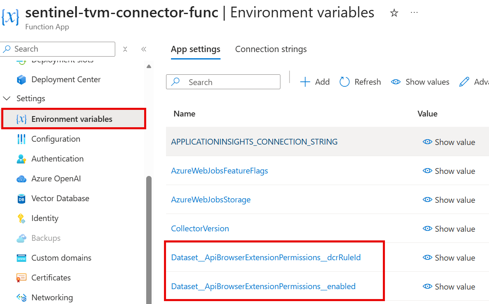

# Sentinel TVM Function-Based Connector

Azure Function connector for collecting Microsoft Defender TVM data and ingesting it into Microsoft Sentinel (Log Analytics custom tables) using DCR/DCE.

## Contents

- [Why this exists](#why-this-exists)
- [What this connector does](#what-this-connector-does)
- [Quick deployment](#quick-deployment)
- [Optional local development setup](#optional-local-development-setup)
- [Post-deployment checks](#post-deployment-parameters-and-validation)
- [Dataset coverage](#dataset-coverage)
- [Table schema model](#table-schema-and-added-columns)
- [Configuration highlights](#configuration-highlights)
- [Folder guides](#folder-guides)
- [Troubleshooting](#troubleshooting)

## Why this exists

This connector is a continuation of the Logic App approach, built to address scale and operational limits seen in larger environments.

The goal is to combine the best parts of two existing paths:

- Official Microsoft Sentinel connector reference:
  <https://github.com/Azure/Azure-Sentinel/tree/master/DataConnectors/M365Defender-VulnerabilityManagement>
- Previous implementation evolution from this repo:
  <https://github.com/AndrewBlumhardt/sentinel-defender-tvm-connector>

The official Sentinel option is useful, but it is not a direct table-for-table migration of every prior pattern. This repo focuses on practical parity where needed, plus stronger deployment repeatability and scale behavior.

## What this connector does

Data collection can run from two source models:

1. Advanced Hunting TVM tables via Microsoft Threat Protection permissions.
2. Defender service REST APIs via WindowsDefenderATP permissions.

Running both lets you compare coverage and keep what works best for your environment.

## Quick deployment

Use this exact order.

1. Clone the repo locally and open PowerShell in the repo folder.
2. Install prerequisites (Azure CLI + Python 3.11), sign in, verify cloud/subscription.
3. Run `scripts/deploy.ps1` — deploys infrastructure and publishes function code.
4. Run `scripts/set-managed-identity-defender-permissions.ps1`.
5. Run post-deployment validation.

### 1) Clone locally and open PowerShell

```powershell
git clone https://github.com/AndrewBlumhardt/sentinel-tvm-function-based-connector.git
Set-Location .\sentinel-tvm-function-based-connector
```

### 2) Sign in and verify context

> **Prerequisites:** [Azure CLI](https://learn.microsoft.com/cli/azure/install-azure-cli) must be installed. Python 3.11 must be available in PATH for dependency vendoring.

The deployed Function App currently uses Python 3.11. For the cleanest publish experience, use a Python 3.11 virtual environment before running `deploy.ps1`.

```powershell
az login
az cloud show --query name -o tsv
az account show --query "{subscription:id, tenant:tenantId, user:user.name}" -o table
```

> **Sign in to the Azure portal first.** Before running `az login`, sign in to the Azure portal in a browser with the same account you'll use for the deploy. This forces an interactive MFA challenge and lets you activate any **Privileged Identity Management (PIM)** eligible roles (typically `Contributor` on the deployment RG, plus whatever role gives you write access on the Sentinel workspace's RG). Without an active PIM assignment the CLI session will pick up only your standing permissions, and `deploy.ps1` will loop on `403 Forbidden` errors during the storage-package upload stage with messages like:
>
> ```
> You do not have the required permissions needed to perform this operation.
> Depending on your operation, you may need to be assigned one of the following roles:
>   "Storage Blob Data Owner"
> ```
>
> If you see this, activate PIM, then run `az logout && az login` (or `az account get-access-token --resource-type arm` to force a token refresh) and rerun the deploy. The script will pick up where it left off — RBAC propagation can also take a couple of minutes, so a 2-3 attempt retry is normal even with the right role active.

### 3) Deploy infrastructure and publish function code

Required access for this step: `Contributor` on the deployment resource group.

```powershell
./scripts/deploy.ps1 `
  -ResourceGroupName <deployment-resource-group> `
  -WorkspaceName <sentinel-workspace-name> `
  -WorkspaceResourceGroupName <workspace-resource-group> `
  -SubscriptionId <subscription-id>
```

For a minimal deployment smoke test (single function module only), add `-SmokeModule` with a module name from `Functions/` (without `.py`):

```powershell
./scripts/deploy.ps1 `
  -ResourceGroupName <deployment-resource-group> `
  -WorkspaceName <sentinel-workspace-name> `
  -WorkspaceResourceGroupName <workspace-resource-group> `
  -SubscriptionId <subscription-id> `
  -SmokeModule device_tvm_software_inventory
```

Smoke mode sets `FUNCTIONS_SMOKE_MODULE` so only that module is registered at startup. Omitting `-SmokeModule` restores normal full-module discovery.

By default, `deploy.ps1` leaves the Function App running after deployment.

> **About the 25 custom tables.** The Bicep template creates **25 `<DatasetName>_CL` custom tables** in the Sentinel workspace (one per dataset in `Functions/datasets.json`), wired to three sharded DCRs. A few things that trip people up:
>
> - **Tables won't appear in the Logs query tool until they receive data** — the schema browser hides empty tables. Toggle **Hide empty tables** off in the table tree filter to see them before the first ingestion.
> - The **Tables blade** in the workspace (`Log Analytics workspace → Tables`) lists them immediately after deploy, even with zero rows. Use that view to confirm table creation.
> - If you want to drop a table you no longer need, do it manually from `Log Analytics workspace → Tables → ... → Delete`. The next Bicep deploy will recreate any table whose dataset is still in `Functions/datasets.json` — to keep it gone, also remove that dataset entry (or set its `enabled` flag to `false`).
> - **Datasets ship enabled by default.** To turn a single dataset off without redeploying Bicep, set the app setting `Enabled_<DatasetName>=false` and restart the Function App. To turn one back on, set it to `true` (or remove the override). Example:
>
>   ```powershell
>   az functionapp config appsettings set `
>     --name <function-app-name> `
>     --resource-group <resource-group> `
>     --settings Enabled_DeviceTvmSoftwareInventory=false
>   az functionapp restart --name <function-app-name> --resource-group <resource-group>
>   ```
>
>   Disabling a dataset stops its timer-triggered function from running but does **not** remove the table or DCR mapping.

#### Cloud selection and Defender endpoint

`deploy.ps1` and the Bicep template auto-detect the deployment cloud. The Microsoft Defender API base URL is derived from `environment().name` at deploy time:

| Cloud | Default `Defender__ApiBaseUrl` |
| --- | --- |
| `AzureCloud` (commercial) | `https://api.security.microsoft.com` |
| `AzureUSGovernment` (GCC High) | `https://api-gov.security.microsoft.us` |

You only need to override this when the auto-mapping doesn't cover your environment (a sovereign cloud not in the table, a private preview endpoint, or local testing). Pass the override through `deploy.ps1`:

```powershell
./scripts/deploy.ps1 `
  -ResourceGroupName <deployment-resource-group> `
  -WorkspaceName <sentinel-workspace-name> `
  -CloudName AzureUSGovernment `
  -DefenderApiBaseUrl https://api-gov.security.microsoft.us
```

Or set it directly on an already-deployed app and restart:

```powershell
az functionapp config appsettings set `
  --name <function-app-name> `
  --resource-group <resource-group> `
  --settings Defender__ApiBaseUrl=https://api-gov.security.microsoft.us
az functionapp restart --name <function-app-name> --resource-group <resource-group>
```

The Python clients use this value for both the request host and the OAuth token scope (`<base>/.default`), so changing it switches both in lock-step.

`deploy.ps1` prints the resolved Function App name during preflight. Use that exact value in follow-on commands.

When ready to test:

```powershell
az functionapp restart --name <function-app-name> --resource-group <deployment-resource-group>
```

If you need to prevent triggers from running immediately after deployment, stop the app manually:

```powershell
az functionapp stop --name <function-app-name> --resource-group <deployment-resource-group>
```

> **Azure Government (GCC High):** Add `-CloudName AzureUSGovernment` to the command above.

### 4) Grant managed identity permissions

This step assigns Microsoft Defender / Threat Protection app roles directly to the Function App's system-assigned managed identity. For a managed identity, an app role assignment **is** the admin consent — there is no separate "grant admin consent" button to click afterward. Because of that, the person who runs this step must have Entra ID privileges that allow writing app role assignments on resource service principals (Microsoft Graph, WindowsDefenderATP, Microsoft Threat Protection).

**Permissions required to deploy infrastructure (Step 3 only):**

- Azure RBAC: `Contributor` on the deployment resource group.
- Azure RBAC: `Contributor` (or write access to `Microsoft.OperationalInsights/workspaces/tables`) on the Sentinel workspace's resource group, so `workspaceTables.bicep` can create the custom `_CL` tables.
- No Entra ID role is required for Step 3.

**Permissions required to grant admin consent (Step 4):** one of the following Entra ID directory roles:

- `Privileged Role Administrator`
- `Global Administrator`

> `Application Administrator` and `Cloud Application Administrator` can register apps but generally cannot grant *resource API* app role assignments (which is what this script does); the operation will fail with a 403 from Microsoft Graph.

Alternatively, the script can be run by any principal that has been granted the Graph application permission `AppRoleAssignment.ReadWrite.All` (already consented in the tenant).

#### Path A — The deployer also has admin-consent rights

Run both scripts back to back:

```powershell
./scripts/set-managed-identity-defender-permissions.ps1 `
  -FunctionAppName <function-app-name> `
  -FunctionAppResourceGroup <deployment-resource-group> `
  -SubscriptionId <subscription-id> `
  -GrantAdminConsent
```

> **Azure Government (GCC High):** Add `-CloudName AzureUSGovernment` to the command above.

#### Path B — The deployer does NOT have admin-consent rights

You can complete Step 3 (infrastructure + code) without any Entra privileges. The Function App will deploy successfully and the host will start, but every dataset call to Defender / Advanced Hunting will fail with `403 Forbidden` until an Entra admin completes this step.

After Step 3, capture the values the admin will need:

```powershell
$funcName = "<function-app-name>"
$deployRg = "<deployment-resource-group>"

az functionapp identity show `
  --name $funcName `
  --resource-group $deployRg `
  --query "{principalId:principalId, tenantId:tenantId}" -o table
```

Send the admin:

- The Function App name and resource group (or principal ID from above).
- A link to this repository, or just the script path: `scripts/set-managed-identity-defender-permissions.ps1`.
- The list of permissions to grant (these are also the script's defaults):
  - `AdvancedHunting.Read.All` (Microsoft Threat Protection)
  - `Machine.Read.All` (WindowsDefenderATP)
  - `Software.Read.All` (WindowsDefenderATP)
  - `Vulnerability.Read.All` (WindowsDefenderATP)
  - `SecurityRecommendation.Read.All` (WindowsDefenderATP)
  - `SecurityConfiguration.Read.All` (WindowsDefenderATP)

The admin then runs the same command shown in Path A. The script is idempotent — re-running it only adds missing assignments. Once consent is granted, function runs will succeed on their next scheduled invocation (no redeploy required).

### 4b) Trigger a one-shot test run (optional but recommended)

After the permissions script completes, you can either wait for the next NCRONTAB tick (up to 1 hour for the slowest datasets) or trigger every timer function once immediately to verify end to end:

```powershell
./scripts/invoke-functions-once.ps1 `
  -FunctionAppName <function-app-name> `
  -ResourceGroupName <deployment-resource-group>
```

This POSTs to each function's `/admin/functions/<name>` endpoint with the master key — the same mechanism the portal **Test/Run** button uses, but it works without browser CORS concerns and is safe on Azure Government. It does **not** change the schedule; the next scheduled tick fires normally afterward.

Run a single function instead of all of them:

```powershell
./scripts/invoke-functions-once.ps1 `
  -FunctionAppName <function-app-name> `
  -ResourceGroupName <deployment-resource-group> `
  -FunctionName AlertsAndIncidents
```

Then watch results in the portal: **Function App → Functions → \<name\> → Invocations** (or **Monitor**).

> **Why not `runOnStartup`?** The Functions runtime fires `runOnStartup=true` timers on *every* host cold-start (Consumption plans cold-start frequently), and with `useMonitor` defaults you can also get a separate catch-up run on startup. That means duplicate rows in your `_CL` tables and extra Defender API traffic. Use this script for ad-hoc testing instead.

> **Portal Test/Run on GCC High.** The deploy script automatically adds the correct portal origin to CORS (`portal.azure.com` for commercial, `portal.azure.us` for `AzureUSGovernment`), so the portal **Code + Test → Test/Run** button also works on Gov clouds without further configuration.

### 5) Confirm deployed resources

<p align="center">
  
</p>

Expected core resources:

- `sentinel-tvm-appi` (Application Insights)
- `sentinel-tvm-dce` (Data Collection Endpoint)
- `sentinel-tvm-dcr-01/02/03` (sharded Data Collection Rules)
- `<namePrefix>-connector-func-<suffix>` (Function App)
- `sentinel-tvm-plan` (App Service plan)
- `stg...` (storage account)

## Optional local development setup

You only need this if you plan to run or debug the function app locally.

```powershell
py -3.11 -m venv .venv
.\.venv\Scripts\python -m pip install -r requirements.txt
Copy-Item local.settings.sample.json local.settings.json
```

## Post-deployment parameters and validation

Use the variables below as your local runbook values.

<p align="center">
  
</p>

Validate identity, RBAC, and app settings:

```powershell
$subId = "<subscription-id>"
$deployRg = "<deployment-resource-group>"
$funcName = "<function-app-name>"
$appiName = "sentinel-tvm-appi"

$funcPrincipalId = az functionapp identity show `
  --name $funcName `
  --resource-group $deployRg `
  --subscription $subId `
  --query principalId -o tsv

az role assignment list `
  --assignee $funcPrincipalId `
  --scope /subscriptions/$subId/resourceGroups/$deployRg `
  --query "[?roleDefinitionName=='Monitoring Metrics Publisher']" -o table

az functionapp config appsettings list `
  --name $funcName `
  --resource-group $deployRg `
  --subscription $subId `
  --query "[?name=='LogsIngestion__Endpoint' || starts_with(name,'DcrRuleId_')].[name,value]" -o table

az monitor app-insights query `
  --app $appiName `
  --resource-group $deployRg `
  --subscription $subId `
  --analytics-query "traces | where timestamp > ago(60m) | project timestamp, severityLevel, message | take 20" -o table
```

## Dataset coverage

Detailed per-dataset mappings are defined in `Functions/datasets.json`.

README keeps this section intentionally high-level:

- Advanced Hunting TVM datasets: enabled by default.
- Defender REST API datasets: optional (mostly disabled by default).
- NIST enrichment datasets: optional.

If you need table-level mapping details, use `Functions/datasets.json` as the source of truth.

## Source comparison and operating model

Use raw Advanced Hunting datasets when you want table-level parity with Defender hunting data and direct KQL access patterns.

Use Defender REST datasets when you want cleaner object models, endpoint-level pagination behavior, or more durable API contracts for high-volume collection.

Recommended operating model:

1. Enable both source families for the domains you care about.
2. Compare the resulting custom tables in Sentinel.
3. Disable the source family you do not need.

## Table schema and added columns

Each dataset table uses a **native per-dataset schema** with columns that directly match the source API or Advanced Hunting response. There is no envelope or `PayloadJson` wrapper.

The only column added beyond the source fields is:

- `TimeGenerated` — ingestion timestamp (UTC ISO 8601), added by the collector at runtime

Column definitions for each dataset are declared in `Functions/datasets.json` under the `columns` array. These definitions drive both the Log Analytics workspace table schema (via `infra/modules/workspaceTables.bicep`) and the Data Collection Rule stream declarations (via `infra/main.bicep`).

Column type conventions:

- `datetime` — stored as `datetime` in DCR stream declarations; Bicep converts to `dateTime` for the workspace table API
- `string`, `boolean`, `int`, `real` — used as-is in both the DCR and workspace table
- `dynamic` — used for source fields that must remain structured JSON objects, such as `AdditionalFields`
- Arrays from the source API are serialized to JSON strings by the collector and stored as `string` columns unless the dataset schema declares the field as `dynamic`

Schema source of truth: `Functions/datasets.json` — edit the `columns` array for each dataset to add, remove, or retype columns. A Bicep redeploy will update the workspace tables and DCR stream declarations automatically.

## Configuration highlights

Primary configuration is in `Functions/datasets.json` and Function App settings.

Key app settings:

- `DatasetConfigPath`
- `LogsIngestion__Endpoint`
- `DcrRuleId_<DatasetName>`
- `Enabled_<DatasetName>`
- `Schedule_<DatasetName>`

Timer format: `second minute hour day month day-of-week`

Example daily schedule: `0 0 1 * * *`

Naming behavior:

- Default Function App name pattern: `<namePrefix>-connector-func-<suffix>`
- Redeploy updates same instance
- Override with `-FunctionAppName` when needed

Permission model:

- `scripts/deploy.ps1` handles Azure RBAC for ingestion resources.
- `set-managed-identity-defender-permissions.ps1` handles Entra API app roles for Defender reads.

Both are required for end-to-end ingestion.

## App setting migration

Use the migration script to rename existing legacy dataset app setting keys in a deployed Function App.

```powershell
./scripts/migrate-dataset-setting-names.ps1 `
  -FunctionAppName <function-app-name> `
  -ResourceGroupName <deployment-resource-group>
```

Apply changes and optionally remove legacy keys after validation:

```powershell
./scripts/migrate-dataset-setting-names.ps1 `
  -FunctionAppName <function-app-name> `
  -ResourceGroupName <deployment-resource-group> `
  -Apply `
  -RemoveLegacy
```

## Required root files

These files stay in the repo root because Azure Functions tooling and packaging expect them there:

- `function_app.py`
- `host.json`
- `requirements.txt`
- `pyrightconfig.json`
- `local.settings.sample.json`

Why each should stay in root:

- `function_app.py`: loaded as the Python v2 function app entry point during local host startup and deployment packaging.
- `host.json`: global Azure Functions host configuration file; the host resolves it from the app root.
- `requirements.txt`: used by build/deploy tooling to install Python dependencies from the project root.
- `pyrightconfig.json`: default Pyright/Pylance project configuration location for workspace-level analysis.
- `local.settings.sample.json`: canonical template for creating `local.settings.json` with the documented root-level copy command.

## Folder guides

- [Functions/README.md](Functions/README.md): Timer-trigger modules and dataset catalog.
- [Shared/README.md](Shared/README.md): Shared runtime and ingestion components.
- [infra/README.md](infra/README.md): Bicep/ARM deployment assets.
- [scripts/README.md](scripts/README.md): Deployment, permission, migration, and validation scripts.
- [images/README.md](images/README.md): Documentation image assets.

## Repo layout

- `function_app.py`: Function app entry point.
- `Functions/datasets.json`: Dataset catalog and defaults.
- `Functions/`: Timer trigger entry points.
- `Shared/`: Shared ingestion runtime.
- `infra/`: Bicep/ARM definitions.
- `scripts/`: Deployment, permissions, migration, and local validation scripts.
- `images/`: Screenshots and diagrams.

## Troubleshooting

> **First place to look after any deploy.** Open the Function App in the portal → **Overview** → click into any function → **Invocations** (or **Monitor**) tab. Errors here are expected until `scripts/set-managed-identity-defender-permissions.ps1` has been run *and* the Function App has been restarted — every timer fire will 401/403 against the Defender API until then. Once permissions are in place, invocations should flip to **Success** on the next scheduled run (within ~5 min for the fastest datasets, up to 1 hour for the slowest). If they're still failing after that, jump to the status-code table below.

1. Cloud/context mismatch.

```powershell
az cloud show --query name -o tsv
az account show --query "{subscription:id, tenant:tenantId}" -o table
```

2. Function App name conflict after RG delete (`already exists`).

- Wait a few minutes and rerun deploy.
- Or use a different `-FunctionAppName`.

3. No data flow after permission script.

- Confirm roles were assigned for both APIs:
  - `Microsoft Threat Protection`
  - `WindowsDefenderATP`

4. Ingestion still failing.

```powershell
az functionapp config appsettings list --name <function-app-name> --resource-group <resource-group> --query "[?name=='LogsIngestion__Endpoint' || starts_with(name,'DcrRuleId_')]" -o table
az role assignment list --assignee <function-mi-object-id> --scope /subscriptions/<sub-id>/resourceGroups/<deployment-rg> --query "[?roleDefinitionName=='Monitoring Metrics Publisher']" -o table
```

5. `HTTPError` raised from `defender_rest_client.py` or `defender_advanced_hunting_client.py`.

The clients now include the HTTP status code, request URL, and response body (truncated to 2 KB) in the raised error, so the *real* failure shows up in the Application Insights / Log stream message. Common causes:

| Status | Meaning | Fix |
| --- | --- | --- |
| `401 Unauthorized` | Missing or invalid token. | Confirm the system-assigned managed identity is enabled and `ManagedIdentity__ClientId` is unset (or matches a real UAMI). Restart the Function App. |
| `403 Forbidden` | Admin consent for the Defender app roles has not been granted. | Run `scripts/set-managed-identity-defender-permissions.ps1 -GrantAdminConsent` as a user with `Privileged Role Administrator` or `Global Administrator`, then **restart the Function App**. |
| `404 Not Found` / DNS error on `api.security.microsoft.com` from a GCC High tenant | Hitting the commercial Defender endpoint from Azure Government. | Verify the app setting `Defender__ApiBaseUrl` — it should be `https://api-gov.security.microsoft.us` in `AzureUSGovernment`. The Bicep selects this automatically based on `environment().name`; if it's wrong, redeploy or set it manually: `az functionapp config appsettings set --settings Defender__ApiBaseUrl=https://api-gov.security.microsoft.us`. |
| `429 Too Many Requests` | Defender API throttling. | The retry policy handles transient throttling; persistent 429s mean lowering `pageSize` for that dataset. |

### Post-deployment verification checklist

Walk this list in the Azure portal after a deploy (or any permissions change) to confirm the pipeline is healthy end to end.

1. **Function App → Functions blade.** Open the Function App and click **Functions**. You should see all **25 timer-triggered functions** listed (one per dataset). If the list is empty or short, the package didn't load — check the deployment logs and confirm `WEBSITE_RUN_FROM_PACKAGE` is set and the SAS URL is still valid.

2. **Function App → Identity → Azure role assignments.** Confirm the system-assigned managed identity holds the Azure RBAC roles it needs:
   - `Monitoring Metrics Publisher` on the deployment resource group (DCR ingestion).
   - `Storage Blob Data Owner` and `Storage Queue Data Contributor` on the Function App's storage account (identity-based `AzureWebJobsStorage`).

3. **Entra ID → Enterprise applications → API permissions.** This is where the Defender / Threat Protection app roles live. They are *not* visible on the Function App's Identity blade.
   - Go to **Microsoft Entra ID → Enterprise applications**.
   - **Uncheck the "Application type == Enterprise Applications" filter** (or change it to **All applications**). Managed identities are hidden by the default filter and won't appear otherwise.
   - Search for the Function App name, open its service principal, and click **Permissions**.
   - Verify all six Defender app roles from Step 4 are listed (AdvancedHunting.Read.All, Machine.Read.All, Software.Read.All, Vulnerability.Read.All, SecurityRecommendation.Read.All, SecurityConfiguration.Read.All).

4. **Log Analytics workspace → Tables.** Open the Sentinel workspace and go to **Tables**. You should see all 25 `<DatasetName>_CL` custom tables. This is the authoritative view — tables show up here as soon as Bicep creates them, even before any data lands.

5. **Log Analytics workspace → Logs.** The query analyzer's table tree hides empty tables by default. If you don't see your `_CL` tables there:
   - Click the filter icon in the table list and **uncheck "Hide empty tables"**.
   - Tables only stop being "empty" after the first successful ingestion. If they stay empty after a function run cycle, look at the Function App's Application Insights traces.

6. **Restart after permission changes.** If you fix or add any role assignment or app-role grant, **restart the Function App** (`Function App → Overview → Restart`, or `az functionapp restart`). The host caches credentials and DCR clients at startup, so a restart is required to pick up new permissions and re-initialize the ingestion pipelines. Otherwise the next scheduled run can still fail with stale 403s.
