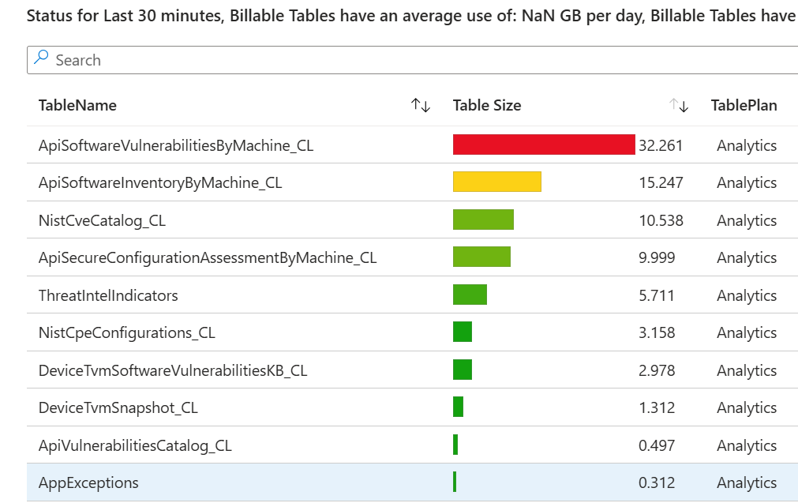
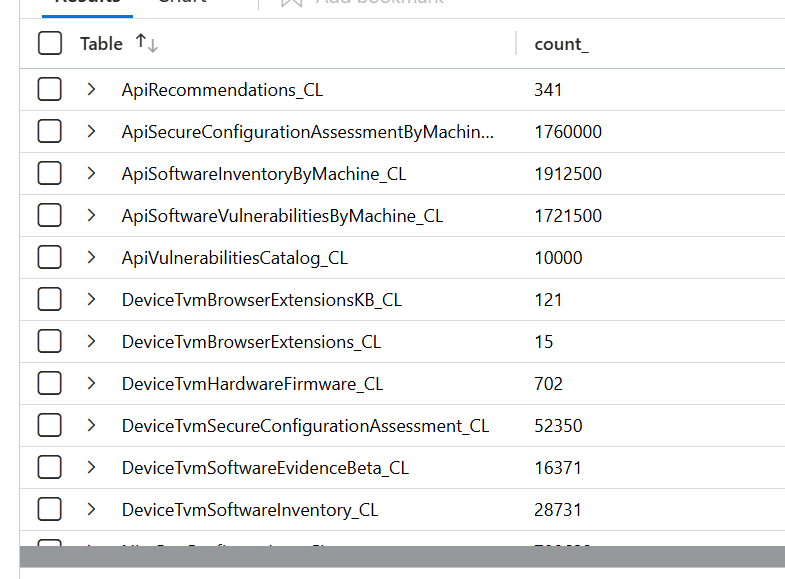

# Sentinel TVM Function-Based Connector

Azure Function connector for collecting Microsoft Defender TVM data and ingesting it into Microsoft Sentinel (Log Analytics custom tables) using DCR/DCE.

## Contents

- [Why this exists](#why-this-exists)
- [What this connector does](#what-this-connector-does)
- [Quick deployment](#quick-deployment)
- [Optional local development setup](#optional-local-development-setup)
- [Post-deployment checks](#post-deployment-parameters-and-validation)
- [Dataset coverage](#dataset-coverage)
- [Folder guides](#folder-guides)
- [Repository root file description](#repository-root-file-description)
- [Troubleshooting](#troubleshooting)

## Why this exists

This connector is a continuation of the Logic App approach, built to address scale and operational limits seen in larger environments.

The goal is to combine the best parts of two existing paths:

- Official Microsoft Sentinel connector reference:
  <https://github.com/Azure/Azure-Sentinel/tree/master/DataConnectors/M365Defender-VulnerabilityManagement>
- Previous implementation evolution from this repo:
  <https://github.com/AndrewBlumhardt/sentinel-defender-tvm-connector>

The official Sentinel option is useful, but it is not a direct table-for-table migration of every prior pattern. This repo focuses on practical parity where needed, plus stronger deployment repeatability and scale behavior.

## What this connector does

Data collection can run from two source models:

1. Advanced Hunting TVM tables via Microsoft Threat Protection permissions.
2. Defender service REST APIs via WindowsDefenderATP permissions.

Running both lets you compare coverage and keep what works best for your environment.

## Quick deployment

1. Clone the repo locally and open PowerShell in the repo folder.
2. Install prerequisites (Azure CLI + Python 3.11), sign in, verify cloud/subscription.
3. Run `scripts/deploy.ps1` — deploys infrastructure, publishes function code, and grants the managed identity its Defender API permissions when the deployer has Entra admin-consent rights.
4. Run `scripts/set-managed-identity-defender-permissions.ps1` only if Step 3 skipped the permission grant (deployer lacked Entra admin-consent rights, or permissions need to be granted out of band by someone with higher privileges).
5. *(Optional)* Run `scripts/invoke-functions-once.ps1` to fire every timer function once and confirm the pipeline end to end without waiting for the next scheduled tick.
6. Run post-deployment validation.

### 1) Clone locally and open PowerShell

```powershell
git clone https://github.com/AndrewBlumhardt/sentinel-tvm-function-based-connector.git
Set-Location .\sentinel-tvm-function-based-connector
```

### 2) Sign in and verify context

> **Prerequisites:** [Azure CLI](https://learn.microsoft.com/cli/azure/install-azure-cli) installed and Python 3.11 on PATH for dependency vendoring. The deployed Function App runs on Python 3.11 — use a matching virtual environment for the cleanest publish.

Set the cloud, sign in, and confirm context. Commercial cloud is the default; use the Gov variant for GCC High.

**Commercial cloud (default):**

```powershell
az cloud set --name AzureCloud
az login
az cloud show --query name -o tsv
az account show --query "{subscription:id, tenant:tenantId, user:user.name}" -o table
```

**Azure US Government (GCC High):**

```powershell
az cloud set --name AzureUSGovernment
az login
az cloud show --query name -o tsv
az account show --query "{subscription:id, tenant:tenantId, user:user.name}" -o table
```

> **Sign in to the Azure portal first.** Before running `az login`, sign in to the Azure portal in a browser with the same account you'll use for the deploy. This forces an interactive MFA challenge and lets you activate any **Privileged Identity Management (PIM)** eligible roles (typically `Contributor` on the deployment RG, plus whatever role gives you write access on the Sentinel workspace's RG). Without an active PIM assignment the CLI session will pick up only your standing permissions, and `deploy.ps1` will loop on `403 Forbidden` errors during the storage-package upload stage with messages like:
>
> ```
> You do not have the required permissions needed to perform this operation.
> Depending on your operation, you may need to be assigned one of the following roles:
>   "Storage Blob Data Owner"
> ```
>
> If you see this, activate PIM, then run `az logout && az login` (or `az account get-access-token --resource-type arm` to force a token refresh) and rerun the deploy. The script will pick up where it left off — RBAC propagation can also take a couple of minutes, so a 2-3 attempt retry is normal even with the right role active.

### 3) Deploy infrastructure and publish function code

Required access for this step: `Contributor` on the deployment resource group, and write access to the Sentinel workspace's resource group (so `workspaceTables.bicep` can create the custom `_CL` tables).

**Commercial cloud (default):**

```powershell
./scripts/deploy.ps1 `
  -ResourceGroupName <deployment-resource-group> `
  -WorkspaceName <sentinel-workspace-name> `
  -WorkspaceResourceGroupName <workspace-resource-group> `
  -SubscriptionId <subscription-id>
```

**Azure US Government (GCC High):** add `-CloudName AzureUSGovernment`.

```powershell
./scripts/deploy.ps1 `
  -ResourceGroupName <deployment-resource-group> `
  -WorkspaceName <sentinel-workspace-name> `
  -WorkspaceResourceGroupName <workspace-resource-group> `
  -SubscriptionId <subscription-id> `
  -CloudName AzureUSGovernment
```

`deploy.ps1` and the Bicep template auto-detect the cloud and pick the correct Defender API hosts (`api.security.microsoft.com` / `api.securitycenter.microsoft.com` for commercial, `api-gov.security.microsoft.us` / `api-gov.securitycenter.microsoft.us` for Gov). The Python clients use the resolved value for both the request host and the OAuth token scope (`<base>/.default`), so changing the cloud switches both in lock-step. Override only when targeting a sovereign cloud not in the auto-mapping or a private preview endpoint:

```powershell
./scripts/deploy.ps1 `
  ... `
  -CloudName AzureUSGovernment `
  -DefenderApiBaseUrl https://api-gov.security.microsoft.us
```

`deploy.ps1` prints the resolved Function App name during preflight — use that exact value in follow-on commands. By default, the Function App is left running after deployment. To prevent triggers from firing immediately, stop it manually:

```powershell
az functionapp stop --name <function-app-name> --resource-group <deployment-resource-group>
```

> **About the 25 custom tables.** The Bicep template creates **25 `<DatasetName>_CL` custom tables** in the Sentinel workspace (one per dataset in `Functions/datasets.json`), wired to three sharded DCRs. A few things that trip people up:
>
> - **Tables won't appear in the Logs query tool until they receive data** — the schema browser hides empty tables. Toggle **Hide empty tables** off in the table tree filter to see them before the first ingestion.
> - The **Tables blade** in the workspace (`Log Analytics workspace → Tables`) lists them immediately after deploy, even with zero rows. Use that view to confirm table creation.
> - If you want to drop a table you no longer need, do it manually from `Log Analytics workspace → Tables → ... → Delete`. The next Bicep deploy will recreate any table whose dataset is still in `Functions/datasets.json` — to keep it gone, also remove that dataset entry (or set its `enabled` flag to `false`).
> - **Datasets ship enabled by default.** To turn a single dataset off without redeploying, **disable the individual function**. Two options:
>   - **Portal (recommended):** Function App → **Functions** → select the function → **Disable**. Click **Enable** to turn it back on.
>   - **CLI:** set the app setting `AzureWebJobs.<FunctionName>.Disabled=true` and restart the Function App. Example:
>
>     ```powershell
>     az functionapp config appsettings set `
>       --name <function-app-name> `
>       --resource-group <resource-group> `
>       --settings AzureWebJobs.DeviceTvmSoftwareInventory.Disabled=true
>     az functionapp restart --name <function-app-name> --resource-group <resource-group>
>     ```
>
>   Disabling a function stops its timer from firing but does **not** remove the underlying table or DCR mapping.

#### GCC High / Azure Government availability

The Defender for Endpoint REST APIs are generally available in GCC High, but a subset of **Microsoft Defender Vulnerability Management (MDVM) premium** capabilities are not exposed on Government clouds (see [Defender for Endpoint for US Government customers](https://learn.microsoft.com/en-us/defender-endpoint/gov)). The following five dataset endpoints currently return `404` on GCC High — disable these functions on Gov deployments (Function App → **Functions** → \<name\> → **Disable**, or set `AzureWebJobs.<FunctionName>.Disabled=true`):

- `DefApiNonCpeSoftwareInventory`
- `DefApiBrowserExtensionsInventory`
- `DefApiBrowserExtensionPermissions`
- `DefApiCertificateInventoryAssessment`
- `DefApiHardwareFirmwareAssessment`

Leaving them enabled is harmless (they log a 404 each tick and produce no rows), but disabling keeps the **Invocations** view clean so real failures stand out. If you hit a `404` on a different `/api/*` endpoint from a Gov tenant, the most likely cause is the same — disable that function and watch the [Defender for Endpoint Gov parity page](https://learn.microsoft.com/en-us/defender-endpoint/gov) for updates.

### 4) Grant managed identity permissions

> **`deploy.ps1` runs this step automatically** when the deployer has Entra admin-consent rights (Global Admin / Privileged Role Administrator). It also restarts the Function App so newly-granted tokens take effect immediately, then prints a one-line `healthcheck` URL you can `curl` to verify Defender connectivity in seconds rather than waiting 30 minutes for a scheduled tick. **You only need to run `set-managed-identity-defender-permissions.ps1` manually if `deploy.ps1` skipped the grant** — either because you passed `-SkipPermissions`, or because the deployer lacks Entra admin-consent rights and someone with higher privileges needs to grant them out of band.

This step assigns Microsoft Defender / Threat Protection app roles directly to the Function App's system-assigned managed identity. For a managed identity, an app role assignment **is** the admin consent — there is no separate "grant admin consent" button to click afterward. Because of that, the person who runs this step must have Entra ID privileges that allow writing app role assignments on resource service principals (Microsoft Graph, WindowsDefenderATP, Microsoft Threat Protection).

**Permissions required to deploy infrastructure (Step 3 only):**

- Azure RBAC: `Contributor` on the deployment resource group.
- Azure RBAC: `Contributor` (or write access to `Microsoft.OperationalInsights/workspaces/tables`) on the Sentinel workspace's resource group, so `workspaceTables.bicep` can create the custom `_CL` tables.
- No Entra ID role is required for Step 3.

**Permissions required to grant admin consent (Step 4):** one of the following Entra ID directory roles:

- `Privileged Role Administrator`
- `Global Administrator`

> `Application Administrator` and `Cloud Application Administrator` can register apps but generally cannot grant *resource API* app role assignments (which is what this script does); the operation will fail with a 403 from Microsoft Graph.

Alternatively, the script can be run by any principal that has been granted the Graph application permission `AppRoleAssignment.ReadWrite.All` (already consented in the tenant).

#### Path A — The deployer also has admin-consent rights

Run both scripts back to back:

```powershell
./scripts/set-managed-identity-defender-permissions.ps1 `
  -FunctionAppName <function-app-name> `
  -FunctionAppResourceGroup <deployment-resource-group> `
  -SubscriptionId <subscription-id> `
  -GrantAdminConsent
```

> **Azure Government (GCC High):** Add `-CloudName AzureUSGovernment` to the command above.

#### Path B — The deployer does NOT have admin-consent rights

You can complete Step 3 (infrastructure + code) without any Entra privileges. The Function App will deploy successfully and the host will start, but every dataset call to Defender / Advanced Hunting will fail with `403 Forbidden` until an Entra admin completes this step.

After Step 3, capture the values the admin will need:

```powershell
$funcName = "<function-app-name>"
$deployRg = "<deployment-resource-group>"

az functionapp identity show `
  --name $funcName `
  --resource-group $deployRg `
  --query "{principalId:principalId, tenantId:tenantId}" -o table
```

Send the admin:

- The Function App name and resource group (or principal ID from above).
- A link to this repository, or just the script path: `scripts/set-managed-identity-defender-permissions.ps1`.
- The list of permissions to grant (these are also the script's defaults):
  - `AdvancedHunting.Read.All` (Microsoft Threat Protection)
  - `AdvancedQuery.Read.All` (Microsoft Threat Protection) — required by `/api/advancedqueries/run` independently of `AdvancedHunting.Read.All`
  - `Machine.Read.All` (WindowsDefenderATP)
  - `Software.Read.All` (WindowsDefenderATP)
  - `Vulnerability.Read.All` (WindowsDefenderATP)
  - `SecurityRecommendation.Read.All` (WindowsDefenderATP)
  - `SecurityConfiguration.Read.All` (WindowsDefenderATP)

The admin then runs the same command shown in Path A. The script is idempotent — re-running it only adds missing assignments. Once consent is granted, function runs will succeed on their next scheduled invocation (no redeploy required).

### 4b) Trigger a one-shot test run (optional)

> **No functions run at deployment time.** By design, `runOnStartup` is disabled (see callout below). After a fresh `deploy.ps1`, the Function App will sit idle until the **next scheduled NCRONTAB tick** for each timer — or until you trigger a run manually with the script in this section. Seeing zero rows on the **Invocations** tab right after deploy is normal.

After `deploy.ps1` finishes (and Step 4 if it was run separately), you have two options to verify end to end:

- **Just wait.** Most datasets run on a 30-minute (or shorter) interval, so within ~30 minutes of granting permissions you should see successful invocations on the **Monitor** / **Invocations** tab. The slowest datasets can take up to 1 hour.
- **Trigger every timer function immediately** to confirm without waiting — useful for smoke-testing a fresh deploy:

```powershell
./scripts/invoke-functions-once.ps1 `
  -FunctionAppName <function-app-name> `
  -ResourceGroupName <deployment-resource-group>
```

This POSTs to each function's `/admin/functions/<name>` endpoint with the master key — the same mechanism the portal **Test/Run** button uses, but it works without browser CORS concerns and is safe on Azure Government. It does **not** change the schedule; the next scheduled tick fires normally afterward.

Run a single function instead of all of them:

```powershell
./scripts/invoke-functions-once.ps1 `
  -FunctionAppName <function-app-name> `
  -ResourceGroupName <deployment-resource-group> `
  -FunctionName AlertsAndIncidents
```

Then watch results in the portal: **Function App → Functions → \<name\> → Invocations** (or **Monitor**).

> **Why not `runOnStartup`?** The Functions runtime fires `runOnStartup=true` timers on *every* host cold-start (Consumption plans cold-start frequently), and with `useMonitor` defaults you can also get a separate catch-up run on startup. That means duplicate rows in your `_CL` tables and extra Defender API traffic. Use this script for ad-hoc testing instead.

> **Portal Test/Run on GCC High.** The deploy script automatically adds the correct portal origin to CORS (`portal.azure.com` for commercial, `portal.azure.us` for `AzureUSGovernment`), so the portal **Code + Test → Test/Run** button also works on Gov clouds without further configuration.

### 4c) Health check (5-second sanity probe)

The deployment includes an HTTP-triggered `HealthCheck` function that probes each Defender API surface your timers will use and returns a JSON matrix of `{host, status, required_roles, hint}`. Use it instead of waiting 30 minutes to find out a role or host is wrong.

```powershell
# 1) Get the default function key (after deploy.ps1 has finished restarting the app -- 60-120s):
$key = az functionapp keys list `
  --name <function-app-name> `
  --resource-group <deployment-resource-group> `
  --query "functionKeys.default" -o tsv

# 2) Baseline probe -- Advanced Hunting POST + Security Center REST GET:
curl "https://<function-app-name>.azurewebsites.net/api/healthcheck?code=$key"

# 3) Full probe -- also hits every configured dataset endpoint with $top=1:
curl "https://<function-app-name>.azurewebsites.net/api/healthcheck?code=$key&full=1"
```

> **GCC High:** replace `.azurewebsites.net` with `.azurewebsites.us` and check `defaultHostName` in the portal if unsure.

Interpretation:

| Result | Meaning | Fix |
|---|---|---|
| `summary.ok = true` | All probed surfaces returned 2xx with the managed identity's token. The next scheduled timer tick will succeed. | None — done. |
| `status: 403` on `advanced_hunting` | Missing `AdvancedQuery.Read.All` and/or `AdvancedHunting.Read.All` on Microsoft Threat Protection SP. | Re-run `set-managed-identity-defender-permissions.ps1 -GrantAdminConsent` then `az functionapp restart` (or just rerun `deploy.ps1`). |
| `status: 403` on `security_center_rest` | Missing one of `Machine.Read.All` / `Vulnerability.Read.All` / etc. on WindowsDefenderATP SP. | Same as above. The `required_roles` field on each result row tells you which role the failing endpoint needs. |
| `status: 404` or DNS error | Wrong base URL for this cloud. | Check `summary.hunting_base` and `summary.security_center_base`. On Gov they MUST be `api-gov.security.microsoft.us` and `api-gov.securitycenter.microsoft.us` respectively — **different hosts**. The Bicep auto-selects these; redeploy or set `Defender__ApiBaseUrl` / `Defender__SecurityCenterApiBaseUrl` manually. |
| `status: null`, error `TOKEN` | Managed identity could not get a token for that audience. | Verify system-assigned identity is enabled on the Function App and the host is reachable from the worker. |

### 5) Confirm deployed resources

<p align="center">
  
</p>

Expected core resources:

- `sentinel-tvm-appi` (Application Insights)
- `sentinel-tvm-dce` (Data Collection Endpoint)
- `sentinel-tvm-dcr-01/02/03` (sharded Data Collection Rules)
- `<namePrefix>-connector-func-<suffix>` (Function App)
- `sentinel-tvm-plan` (App Service plan)
- `stg...` (storage account)

## Optional local development setup

You only need this if you plan to run or debug the function app locally.

```powershell
py -3.11 -m venv .venv
.\.venv\Scripts\python -m pip install -r requirements.txt
Copy-Item local.settings.sample.json local.settings.json
```

## Post-deployment parameters and validation

Use the variables below as your local runbook values.

<p align="center">
  
</p>

Validate identity, RBAC, and app settings:

```powershell
$subId = "<subscription-id>"
$deployRg = "<deployment-resource-group>"
$funcName = "<function-app-name>"
$appiName = "sentinel-tvm-appi"

$funcPrincipalId = az functionapp identity show `
  --name $funcName `
  --resource-group $deployRg `
  --subscription $subId `
  --query principalId -o tsv

az role assignment list `
  --assignee $funcPrincipalId `
  --scope /subscriptions/$subId/resourceGroups/$deployRg `
  --query "[?roleDefinitionName=='Monitoring Metrics Publisher']" -o table

az functionapp config appsettings list `
  --name $funcName `
  --resource-group $deployRg `
  --subscription $subId `
  --query "[?name=='LogsIngestion__Endpoint' || starts_with(name,'DcrRuleId_')].[name,value]" -o table

az monitor app-insights query `
  --app $appiName `
  --resource-group $deployRg `
  --subscription $subId `
  --analytics-query "traces | where timestamp > ago(60m) | project timestamp, severityLevel, message | take 20" -o table
```

## Dataset coverage

Detailed per-dataset mappings live in `Functions/datasets.json` (the source of truth). The table below captures the **recommended starting configuration** — which datasets to enable by default, which to leave off, and why. Names use the current `DefApi*` (Defender REST) and `DeviceTvm*` (Graph Advanced Hunting) prefixes.

At a glance:

- Advanced Hunting `DeviceTvm*` datasets: the recommended baseline. Enabled by default.
- Defender REST `DefApi*` datasets: optional. Most are disabled by default — some duplicate TVM data, a few produce very large volumes, and several are unavailable in GCC High / Gov.
- `Nist*` enrichment datasets: optional. Generally disabled by default; better suited to on-demand lookups than continuous ingestion.

| Table                                           | Source                         | Summary                                                                                                                              | Recommendation                                                                                           | Frequency     | Default  |
| ----------------------------------------------- | ------------------------------ | ------------------------------------------------------------------------------------------------------------------------------------ | -------------------------------------------------------------------------------------------------------- | ------------- | -------- |
| DefApiBrowserExtensionPermissions_CL            | Defender for Endpoint REST API | Browser extension permissions and permission risk information. Conceptually similar to `DeviceTvmBrowserExtensionsKB_CL`.            | Prefer TVM equivalent. API endpoint unavailable in GCC High / Gov environments.                          | Weekly        | Disabled |
| DefApiBrowserExtensionsInventory_CL             | Defender for Endpoint REST API | Browser extension inventory per device. Similar to `DeviceTvmBrowserExtensions_CL`.                                                  | Prefer TVM equivalent. API endpoint unavailable in GCC High / Gov environments.                          | Weekly        | Disabled |
| DeviceTvmBrowserExtensions_CL                   | Graph Advanced Hunting (KQL)   | Extension ID, name, version, browser, risk, active state per device.                                                                 | Recommended primary browser extension inventory table.                                                   | Weekly        | Enabled  |
| DeviceTvmBrowserExtensionsKB_CL                 | Graph Advanced Hunting (KQL)   | Extension details plus descriptions and permission risk information.                                                                 | Recommended companion reference table with richer metadata.                                              | Weekly        | Enabled  |
| DefApiCertificateInventoryAssessment_CL         | Defender for Endpoint REST API | Certificate inventory assessment per device. Similar to `DeviceTvmCertificateInfo_CL`.                                               | Prefer TVM equivalent. API endpoint unavailable in GCC High / Gov environments.                          | Weekly        | Disabled |
| DeviceTvmCertificateInfo_CL                     | Graph Advanced Hunting (KQL)   | Basic certificate information per device.                                                                                            | Recommended lightweight enrichment table.                                                                | Weekly        | Enabled  |
| DefApiHardwareFirmwareAssessment_CL             | Defender for Endpoint REST API | Hardware and firmware assessment data per device.                                                                                    | Prefer TVM equivalent. API endpoint unavailable in GCC High / Gov environments.                          | Weekly        | Disabled |
| DeviceTvmHardwareFirmware_CL                    | Graph Advanced Hunting (KQL)   | Limited hardware inventory such as processor and firmware details per device.                                                        | Useful enrichment dataset with low change frequency.                                                     | Weekly        | Enabled  |
| DefApiNonCpeSoftwareInventory_CL                | Defender for Endpoint REST API | Software inventory for products without CPE mappings.                                                                                | Unique API-only dataset. Useful supplemental inventory source.                                           | Weekly        | Enabled  |
| DefApiMachines_CL                               | Defender for Endpoint REST API | Lightweight device inventory snapshot similar to native `DeviceInfo`.                                                                | Not recommended. Redundant with richer native device inventory tables already available in Defender XDR. | Disabled      | Disabled |
| DefApiRecommendations_CL                        | Defender for Endpoint REST API | Top-level recommendations list with minimal detail and no device context.                                                            | Optional low-value reference table.                                                                      | Weekly        | Disabled |
| DefApiSecureConfigAssessmentByMachine_CL        | Defender for Endpoint REST API | Extremely granular secure configuration data. ~25k records per device and difficult to interpret.                                    | Not recommended due to excessive volume and limited operational value.                                   | Disabled      | Disabled |
| DeviceTvmSecureConfigurationAssessment_CL       | Graph Advanced Hunting (KQL)   | Device-level configuration assessment data, primarily configuration IDs.                                                             | Moderate value but limited detail on its own. Often requires joins.                                      | Daily         | Enabled  |
| DeviceTvmSecureConfigurationAssessmentKB_CL     | Graph Advanced Hunting (KQL)   | Detailed recommendation and configuration reference data.                                                                            | Recommended primary secure configuration assessment table. Most useful table in this category.           | Daily         | Enabled  |
| DefApiSoftwareInventoryByMachine_CL             | Defender for Endpoint REST API | Installed software inventory with registry key and first-seen details.                                                              | Slightly richer than TVM equivalent. Useful optional replacement for TVM inventory.                      | Daily         | Disabled |
| DeviceTvmSoftwareInventory_CL                   | Graph Advanced Hunting (KQL)   | Installed software inventory per device.                                                                                             | Recommended baseline software inventory table.                                                           | Daily         | Enabled  |
| DefApiSoftwareVulnerabilitiesByMachine_CL       | Defender for Endpoint REST API | Every known CVE for every installed software instance per device. Extremely large dataset.                                           | Not recommended for regular ingestion due to excessive size.                                             | Disabled      | Disabled |
| DefApiVulnerabilitiesCatalog_CL                 | Defender for Endpoint REST API | Catalog of all known CVEs across observed software inventory. Includes descriptions and metadata.                                    | Optional reference dataset for joins or enrichment.                                                      | Every 10 Days | Disabled |
| DeviceTvmSoftwareVulnerabilities_CL             | Graph Advanced Hunting (KQL)   | Active CVEs per device with useful operational detail.                                                                               | Recommended primary vulnerability assessment dataset.                                                    | Daily         | Enabled  |
| DeviceTvmSoftwareVulnerabilitiesKB_CL           | Graph Advanced Hunting (KQL)   | Top-level CVE catalog and vulnerability reference table.                                                                             | Recommended companion vulnerability reference dataset.                                                   | Daily         | Enabled  |
| DeviceTvmSoftwareEvidenceBeta_CL                | Graph Advanced Hunting (KQL)   | Active vulnerabilities plus software evidence such as disk and registry paths.                                                       | Optional enrichment dataset with useful investigation context.                                           | Daily         | Disabled |
| DeviceTvmInfoGathering_CL                       | Graph Advanced Hunting (KQL)   | Supplemental device assessment information including AV scan results. Small dataset.                                                 | Recommended lightweight enrichment dataset.                                                              | Daily         | Enabled  |
| DeviceTvmInfoGatheringKB_CL                     | Graph Advanced Hunting (KQL)   | Reference table for `FieldName` descriptions used in `DeviceTvmInfoGathering_CL`.                                                    | Optional lookup/reference dataset for dashboards and workbook enrichment.                                | Weekly        | Disabled |
| NistCpeConfigurations_CL                        | NIST Reference Dataset         | Extremely large CVE/CPE reference list with cryptic short-form configuration descriptors.                                            | Strongly discouraged due to ingestion cost and limited standalone value.                                 | Every 10 Days | Disabled |
| NistCveCatalog_CL                               | NIST Reference Dataset         | Detailed NIST CVE catalog with larger record size and descriptive metadata.                                                          | Better suited for external enrichment or URL/API lookups than ingestion.                                 | Every 10 Days | Disabled |

### Why some Defender REST datasets are disabled by default

A handful of the `DefApi*` tables generate disproportionate ingestion volume relative to the operational value they add on top of the `DeviceTvm*` equivalents. The two snapshots below are taken from a representative deployment and illustrate the pattern.

Billable table size, top tables (30-minute window):



Record counts per table from a single collection cycle:



`DefApiSoftwareVulnerabilitiesByMachine_CL`, `DefApiSoftwareInventoryByMachine_CL`, and `DefApiSecureConfigAssessmentByMachine_CL` consistently dominate both record count and on-disk size. The `DeviceTvm*` siblings cover the same operational use cases at a fraction of the volume — hence the defaults in the table above.

Note: table names in the screenshots reflect the older `Api*` prefix from earlier deployments. New deployments use `DefApi*`; the data shape is unchanged.

## Source comparison and operating model

Use raw Advanced Hunting datasets when you want table-level parity with Defender hunting data and direct KQL access patterns.

Use Defender REST datasets when you want cleaner object models, endpoint-level pagination behavior, or more durable API contracts for high-volume collection.

Recommended operating model:

1. Enable both source families for the domains you care about.
2. Compare the resulting custom tables in Sentinel.
3. Disable the source family you do not need.

Dataset schemas, default schedules, and the `enabled` flag all live in `Functions/datasets.json` — that file is the source of truth. To turn an individual dataset off without redeploying, disable the corresponding function (Function App → **Functions** → \<name\> → **Disable**, or set `AzureWebJobs.<FunctionName>.Disabled=true`).

## Repository root file description

These files stay in the repo root because Azure Functions tooling and packaging expect them there:

- `function_app.py`
- `host.json`
- `requirements.txt`
- `pyrightconfig.json`
- `local.settings.sample.json`

Why each should stay in root:

- `function_app.py`: loaded as the Python v2 function app entry point during local host startup and deployment packaging.
- `host.json`: global Azure Functions host configuration file; the host resolves it from the app root.
- `requirements.txt`: used by build/deploy tooling to install Python dependencies from the project root.
- `pyrightconfig.json`: default Pyright/Pylance project configuration location for workspace-level analysis.
- `local.settings.sample.json`: canonical template for creating `local.settings.json` with the documented root-level copy command.

## Folder guides

- [Functions/README.md](Functions/README.md): Timer-trigger modules and dataset catalog.
- [Shared/README.md](Shared/README.md): Shared runtime and ingestion components.
- [infra/README.md](infra/README.md): Bicep/ARM deployment assets.
- [scripts/README.md](scripts/README.md): Deployment, permission, migration, and validation scripts.
- [images/README.md](images/README.md): Documentation image assets.

## Repo layout

- `function_app.py`: Function app entry point.
- `Functions/datasets.json`: Dataset catalog and defaults.
- `Functions/`: Timer trigger entry points.
- `Shared/`: Shared ingestion runtime.
- `infra/`: Bicep/ARM definitions.
- `scripts/`: Deployment, permissions, migration, and local validation scripts.
- `images/`: Screenshots and diagrams.

## Troubleshooting

> **First place to look after any deploy.** Open the Function App in the portal → **Overview** → click into any function → **Invocations** (or **Monitor**) tab. Errors here are expected until `scripts/set-managed-identity-defender-permissions.ps1` has been run *and* the Function App has been restarted — every timer fire will 401/403 against the Defender API until then. Once permissions are in place, invocations should flip to **Success** on the next scheduled run (within ~5 min for the fastest datasets, up to 1 hour for the slowest). If they're still failing after that, jump to the status-code table below.

> **Expected deploy duration: ~10 minutes.** A clean `scripts/deploy.ps1` run typically completes in under 10 minutes end-to-end (infra deploy, code publish, RBAC, restart, verification). If it runs **significantly longer than 10 minutes**, something is likely stuck — check the CLI output for the last stage emitted; common culprits are ARM/Bicep provisioning waiting on a soft-deleted resource, storage SAS retry loops (PIM not active), or Functions runtime warm-up. If it finishes **significantly faster than ~5 minutes**, a stage probably exited early without applying changes; scroll back through the CLI output looking for `WARNING`/`ERROR` lines or skipped stages. The script emits clear per-stage banners (`==> Stage: ...`) plus warnings inline — read the CLI output as you go rather than waiting for the final summary.

1. Cloud/context mismatch.

```powershell
az cloud show --query name -o tsv
az account show --query "{subscription:id, tenant:tenantId}" -o table
```

2. Function App name conflict after RG delete (`already exists`).

- Wait a few minutes and rerun deploy.
- Or use a different `-FunctionAppName`.

3. No data flow after permission script.

- Confirm roles were assigned for both APIs:
  - `Microsoft Threat Protection`
  - `WindowsDefenderATP`

4. Ingestion still failing.

```powershell
az functionapp config appsettings list --name <function-app-name> --resource-group <resource-group> --query "[?name=='LogsIngestion__Endpoint' || starts_with(name,'DcrRuleId_')]" -o table
az role assignment list --assignee <function-mi-object-id> --scope /subscriptions/<sub-id>/resourceGroups/<deployment-rg> --query "[?roleDefinitionName=='Monitoring Metrics Publisher']" -o table
```

5. `HTTPError` raised from `defender_rest_client.py` or `defender_advanced_hunting_client.py`.

6. Defender endpoint availability check.

If a single dataset is consistently failing and the health check doesn't make the cause obvious, use `scripts/Test-DefenderEndpoints.ps1` to probe each Defender REST endpoint directly with the Function App's managed identity token. It returns a per-endpoint pass/fail matrix so you can confirm whether a 404 is environmental (Gov capability gap, see [GCC High / Azure Government availability](#gcc-high--azure-government-availability)) or specific to your tenant.

The clients now include the HTTP status code, request URL, and response body (truncated to 2 KB) in the raised error, so the *real* failure shows up in the Application Insights / Log stream message. Common causes:

| Status | Meaning | Fix |
| --- | --- | --- |
| `401 Unauthorized` | Missing or invalid token. | Confirm the system-assigned managed identity is enabled and `ManagedIdentity__ClientId` is unset (or matches a real UAMI). Restart the Function App. |
| `403 Forbidden` | Admin consent for the Defender app roles has not been granted. | Run `scripts/set-managed-identity-defender-permissions.ps1 -GrantAdminConsent` as a user with `Privileged Role Administrator` or `Global Administrator`, then **restart the Function App**. If the error body says `API required roles: AdvancedQuery.Read.All, application roles: AdvancedHunting.Read.All`, the managed identity has `AdvancedHunting.Read.All` but is missing the separate `AdvancedQuery.Read.All` role on the same Microsoft Threat Protection SP — re-run the permissions script (it now requests both) and restart. |
| `404 Not Found` / DNS error on `api.security.microsoft.com` from a GCC High tenant | Hitting the commercial Defender endpoint from Azure Government. | Verify the app setting `Defender__ApiBaseUrl` — it should be `https://api-gov.security.microsoft.us` in `AzureUSGovernment`. The Bicep selects this automatically based on `environment().name`; if it's wrong, redeploy or set it manually: `az functionapp config appsettings set --settings Defender__ApiBaseUrl=https://api-gov.security.microsoft.us`. |
| `429 Too Many Requests` | Defender API throttling. | The retry policy handles transient throttling; persistent 429s mean lowering `pageSize` for that dataset. |

### Post-deployment verification checklist

Walk this list in the Azure portal after a deploy (or any permissions change) to confirm the pipeline is healthy end to end.

1. **Function App → Functions blade.** Open the Function App and click **Functions**. You should see all **25 timer-triggered functions** listed (one per dataset). If the list is empty or short, the package didn't load — check the deployment logs and confirm `WEBSITE_RUN_FROM_PACKAGE` is set and the SAS URL is still valid.

2. **Function App → Identity → Azure role assignments.** Confirm the system-assigned managed identity holds the Azure RBAC roles it needs:
   - `Monitoring Metrics Publisher` on the deployment resource group (DCR ingestion).
   - `Storage Blob Data Owner` and `Storage Queue Data Contributor` on the Function App's storage account (identity-based `AzureWebJobsStorage`).

3. **Entra ID → Enterprise applications → API permissions.** This is where the Defender / Threat Protection app roles live. They are *not* visible on the Function App's Identity blade.
   - Go to **Microsoft Entra ID → Enterprise applications**.
   - **Uncheck the "Application type == Enterprise Applications" filter** (or change it to **All applications**). Managed identities are hidden by the default filter and won't appear otherwise.
   - Search for the Function App name, open its service principal, and click **Permissions**.
   - Verify all seven Defender app roles from Step 4 are listed (AdvancedHunting.Read.All, AdvancedQuery.Read.All, Machine.Read.All, Software.Read.All, Vulnerability.Read.All, SecurityRecommendation.Read.All, SecurityConfiguration.Read.All).

4. **Log Analytics workspace → Tables.** Open the Sentinel workspace and go to **Tables**. You should see all 25 `<DatasetName>_CL` custom tables. This is the authoritative view — tables show up here as soon as Bicep creates them, even before any data lands.

5. **Log Analytics workspace → Logs.** The query analyzer's table tree hides empty tables by default. If you don't see your `_CL` tables there:
   - Click the filter icon in the table list and **uncheck "Hide empty tables"**.
   - Tables only stop being "empty" after the first successful ingestion. If they stay empty after a function run cycle, look at the Function App's Application Insights traces.

   To quickly see which `_CL` tables have received data, run:

   ```kusto
   union withsource=Table *_CL
   | summarize count() by Table
   ```

   You should see all 25 `<DatasetName>_CL` tables in the results once every function has fired successfully at least once. **Missing tables on this list are the fastest signal** that either (a) the corresponding function is failing — check its **Invocations** tab — or (b) the dataset relies on an API that isn't available in your cloud (see [GCC High / Azure Government availability](#gcc-high--azure-government-availability)).

6. **Restart after permission changes.** If you fix or add any role assignment or app-role grant, **restart the Function App** (`Function App → Overview → Restart`, or `az functionapp restart`). The host caches credentials and DCR clients at startup, so a restart is required to pick up new permissions and re-initialize the ingestion pipelines. Otherwise the next scheduled run can still fail with stale 403s.
